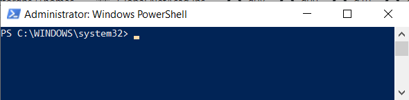
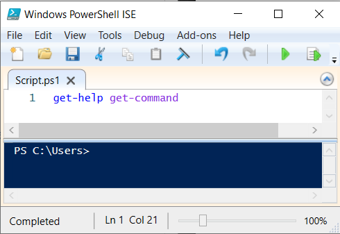

# 1 Powershell
## 1.1 Wat is Powershell?
### 1.1.1 Shell
Zoals het woord zegt is Powershell een krachtige shell die standaard bij Windows is inbegrepen en ook noodzakelijk is voor de correcte werking van een windows besturingssysteem.

> Een shell is een cruciaal onderdeel van een besturingssysteem dat de gebruiker in staat stelt om via een CLI (Command Line Interface) te communiceren met, en opdrachten door te geven aan het besturingssysteem.

Powershell is de opvolger van MS-DOS (Microsoft Disk Operating System), wat een van de eerste besturingssystemen was voor personal computers.  

De eerste versies van Windows draaiden trouwens als applicatie bovenop MS-DOS. Bij Windows 95, Windows 98 en Windows ME was het zo dat MS-DOS eerst gestart werd alvorens de GUI opgestart werd. Het was zelfs mogelijk om de computer op te starten in MS-DOS, zonder de grafische Windows omgeving. Bij de huidige versies van Windows is dit echter nier meer het geval, en is MS-DOS enkel nog beschikbaar als emulator.

In 2006 introduceerde Microsoft, PowerShell 1.0 als vervanger voor MS-DOS, en ondertussen is Powershell versie 5 standaard inbegrepen in de huidige versies van Windows.  
Doordat Powershell de opvolger is van MS-DOS moest de backward compability verzekerd worden, en dat is ook zo: je kan zonder problemen DOS-commando's gebruiken in Powershell (**Let op!**: omgekeerd geldt dit niet!) 

Vanaf versie 6.0 is Powershell open source én platformonafhankelijk geworden. Powershell kan nu dus ook gebruikt worden op Linux en MacOS besturingssystemen. De laatste stabiele versie van powershell is momenteel versie 7.3 

### 1.1.2 Scripting taal

Naast een shell is Powershell ook een objectgeoriënteerde scriptingtaal.
> Een scriptingtaal is een programmeertaal waarmee je scripts kan schrijven. Hierbij is een script een reeks opeenvolgende instructies of opdrachten die uitgevoerd moeten worden door een computer. 

Voordelen van scripts zijn:
* **Ze kunnen saaie en/of herhaalde taken automatiseren.**  
Waarom zouden we bijvoorbeeld manueel 100 gebruikers aanmaken als een eenvoudig script dit kan doen in een paar seconden?
* **Ze verminderden de kans op fouten.**  
Als je manueel gebruikers aanmaakt is de kans op een typefout groot, terwijl de kans op een fout miniem is bij een correct werkend script.
* Goed geschreven scripts zijn ook **herbruikbaar**

## 1.2 Toepassingsmogelijkheden van powershell

Powershell is ontwikkeld om systeembeheerders en ontwikkelaars te helpen bij het beheer en configuratie van heel veel Microsoft (en zelfs enkele third-party) producten.
Enkele voorbeelden:
* **Active Directory**: Eenvoudig om AD-objecten zoals  gebruikersaccounts, groepen, beleidsregels, ... te beheren
* **Netwerkbeheer**: Configureren van firewalls, netwerkinterfaces
* **Exchange Server**: Beheer en configuratie van de mailomgeving van Microsoft
* **Microsoft SQL Server**: Relationeel databasebeheersysteem
* **Beveiliging**: Uitvoeren van vulnerabilityscans, controleren van veiligheidsinstellingen, ...
* ...  

## 1.3 Powershell hosts

Om met Powershell te werken heb je een PowerShell host nodig. Dat is een applicatie die commando's doorgeeft aan de PowerShell Engine. Microsoft heeft standaard 2 PowerShell hosts ingebouwd:
* de **console**: 
    * Typisch blauw venster  
    
    * Bruikbaar om eenvoudige PowerShell commando's uit te voeren en voor een eerste verkenning van PowerShell
    * Openen door:
        * met de rechtermuistoets op het windowsicoon op de taakbalk te klikken en `'Windows PowerShell (Admin)'` selecteren
        * Powershell in te geven in het zoekvenster van de taakbalk en `Windows Powershell` te starten <INS>als administrator</INS>.  
                (Dus **niet** `Windows Powershell(x86)`, want dat is de 32-bit versie) 

        *Het is belangrijk om de console als administrator te openen om alle taken uit te kunnen voeren. In de titelbalk van de console zal dan `Administrator: Windows PowerShell` staan.

* de **ISE** (Integrated Scripting Environment) 
    * Opgedeeld in een script editor en een console host  
        
    * Grafische omgeving die, o.a. door auto-completion en syntax-highlighting, uiterst geschikt is om PowerShell scripts te schrijven en uit te voeren.
    * Openen door 'Powershell ISE' in te geven in het zoekvenster van de taakbalk en `Windows Powershell ISE` te starten als administrator.  


Er zijn ook third-party hosts zoals PowerGUI, VSCode, PowerShell Studio. Hou er rekening mee dat de resultaten van PowerShell commando's er in elke host anders uit kunnen zien. Dit is niet te wijten aan PowerShell, maar louter aan de hosts zelf. 

<INS>*Oefening 1*</INS>:  
Open een PowerShell console, zoek op het web een lijst van DOS-commando's op (CLS, CD, MD, DIR,...), en kijk of deze nog steeds werken als je ze ermee aan de slag gaat in de PowerShell console.

>Controleer vooraleer je verder gaat met oefening 2 de Execution Policy die op je PC staat ingesteld.
Doe dit met het commando:  
`"Get-ExecutionPolicy"`   
Bij een gewone Windows client zal dit standaard op `Restricted` ingesteld staan, wat betekent dat geen enkel script uitgevoerd zal worden. (Bij Windows server is de default waarde `RemoteSigned`)  
Aangezien wij (enkel) onze zelfgeschreven scripts willen uitvoeren, moeten we de Execution Policy op `RemoteSigned` instellen. Doe dit met volgend commando (als **Administrator!**):  
```"Set-ExecutionPolicy RemoteSigned"```  
Je kan checken of het gelukt is door nogmaals het commando `"Get-ExecutionPolicy"` uit te voeren.


<INS>*Oefening 2*</INS>:  
1. Open een Powershell ISE console als administrator
2. Maak een nieuw Powershell script aan in de script-editor (dus niet in het blauwe console venster)
3. Geef volgende code in: 
```powershell
Write-Host "Hello World"
```
4. Sla het script op onder de naam 'Hello World'. Wat is de extentie die wordt meegegeven? 
5. Voer het script uit door op F5 te drukken of te klikken op de groene pijl 

<INS>*Oefening 3*</INS>:
1. Open kladblok (notepad) en maak een nieuwe file met volgende code:
```powershell
WHOAMI
```
2. Save dit bestand in de directory 'Documents' powershell script door het de powershell-extentie uit punt 4 mee te geven. Sla het script op in 'Documents'
3. Open een nieuwe powershell tab in de ISE met `CTRL+T`
4. Open de file die je net hebt gemaakt en voer het script uit. Bekijk in het console venster wat de functie is van het script.

Je kan m.a.w. elke willekeurige tekstverwerker gebruiken om een powershell script schrijven. Je mist dan wel de voordelen van de ISE (ingebouwde help, syntax highlighting,... )


